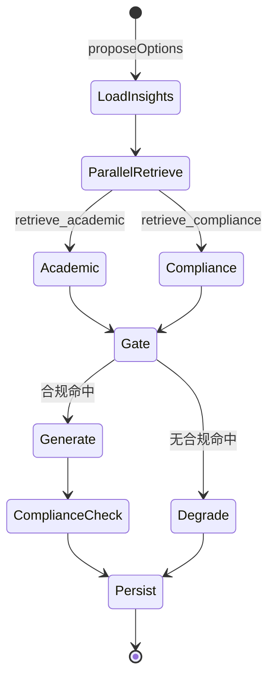
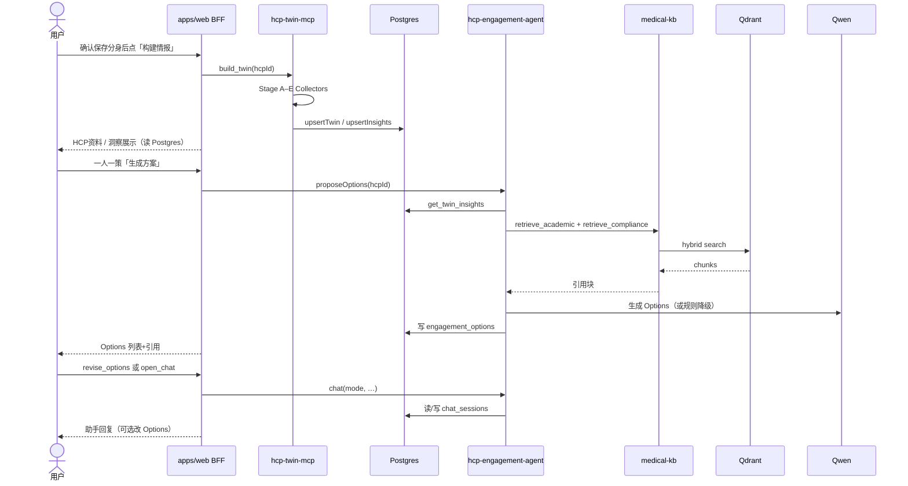

# HCP Engagement Assistant — 整体技术架构

> 权威架构规格。基准日 2026-07-16；**与实现核对 as_of：2026-07-20**。  
> 技术选型与依赖版本见 [`4.install-dependencies.md`](./4.install-dependencies.md)；缺口见 [`ToDo.md`](./ToDo.md)；业务背景见 [`2.business-context.md`](./2.business-context.md)。

---

## 1. 文档定位

| 文档 | 回答的问题 |
|------|------------|
| `product-definition.md` | 做什么、给谁用 |
| **本文 `architecture.md`** | 系统如何分层、模块如何协作、数据如何流动 |
| `4.install-dependencies.md` | 用什么技术、装什么包、怎么部署、`data/` 初始化 |
| `knowledge/` | 研究结论、数据源、RAG/Agent 细化决策 |

**设计哲学（四技能综合）**

| 来源 | 原则 |
|------|------|
| agent-builder | 模型即智能体；代码提供 **Capabilities + Knowledge + Context + Permissions**；P0 仅 5 个能力 |
| rag-implementation | 双索引 Hybrid 检索 + Rerank + **强制引用**，降低幻觉 |
| mcp-server-patterns | 采集与 UI **进程隔离**；Tool schema 先行；stdio / Streamable HTTP 可切换 |
| ai-architect-expert | 训练/采集、检索、推理 **分轨**；可观测、可版本化、可回滚 |

---

## 2. 系统目标与非目标

### 2.1 目标

在中国医药合规边界内，为指定 HCP 提供：

1. **Virtual Twin**：基于公开信息的数字分身（职业、科研、活动热力）
2. **Insights**：可解释的兴趣点与 unmet need 摘要
3. **Engagement Options**：3–5 条可执行、带学术与合规引用的互动建议
4. **Assistant**：在同一上下文上对话修订 Options

**P0 验收用例**：复旦大学附属中山医院朱同玉教授。

### 2.2 非目标（P0 不做）

| 非目标 | 原因 |
|--------|------|
| 替代正式 MLR | 输出为辅助建议，须人工审核 |
| 全渠道 CRM / 中台 | 行业缺口在「聊什么」，不在「有没有系统」 |
| 全科医学向量库预灌 | 按 Twin 专科 **按需 ingest** |
| 本地 JSON 作主库 | 规格选定 **远程 MySQL** + Qdrant（向量） |
| 统方 / 处方 / 非公开 CRM 数据 | 合规与权限边界 |

---

## 3. 逻辑架构（五层）

```text
┌─────────────────────────────────────────────────────────────┐
│  表达层   apps/web — Twin / Insights / Options / Assistant   │
├─────────────────────────────────────────────────────────────┤
│  决策层   hcp-engagement-agent — 5 capabilities + 手写薄编排 │
├─────────────────────────────────────────────────────────────┤
│  知识层   medical-kb — academic_index ‖ compliance_index     │
├─────────────────────────────────────────────────────────────┤
│  感知层   hcp-twin-mcp — collectors → Twin / Insights（Postgres） │
├─────────────────────────────────────────────────────────────┤
│  约束层   cn-hcp-compliance + cn-hcp-pro + 人审 MLR          │
└─────────────────────────────────────────────────────────────┘
```

| 层 | 职责 | 不负责 |
|----|------|--------|
| 表达层 | BFF、页面、会话 UX、导出 | 爬虫、向量检索实现 |
| 决策层 | 编排检索、生成 Options、多轮修订 | 存储全量指南、抓取网页 |
| 知识层 | Ingest、Hybrid 检索、引用块 | HCP 画像构建 |
| 感知层 | 公开信息采集、消歧、Insights 衍生 | Engagement 文案生成 |
| 约束层 | Fail-fast、行业准则、说明书边界 | 业务数据采集 |

---

## 4. 物理架构

```mermaid
flowchart TB
    subgraph client [Browser]
        UI[Next.js UI]
    end

    subgraph web_proc [apps/web 进程]
        BFF[/api/* BFF]
        AgentPkg[hcp-engagement-agent]
        MedKbPkg[medical-kb]
        MCPClient[mcp-client]
    end

    subgraph twin_proc [hcp-twin-mcp 进程]
        MCPServer[MCP Server]
        Collectors[Collectors]
        PW[Playwright]
    end

    subgraph data_plane [数据平面]
        PG[(MySQL)]
        Qdrant[(Qdrant 向量)]
        Corpus[data/rag/corpus 语料暂存]
    end

    subgraph external [外部服务]
        LLM[DashScope Qwen]
        OpenAPIs[OpenAlex / ORCID / PubMed / CT.gov]
    end

    UI --> BFF
    BFF --> MCPClient
    BFF --> AgentPkg
    BFF --> PG
    MCPClient -->|Streamable HTTP :3200| MCPServer
    MCPServer --> Collectors
    Collectors --> OpenAPIs
    Collectors -.->|后置| PW
    MCPServer --> PG
    AgentPkg --> MedKbPkg
    AgentPkg --> PG
    AgentPkg --> LLM
    MedKbPkg --> Qdrant
    MedKbPkg --> PG
    MedKbPkg --> Corpus
```

### 4.1 进程边界（硬规则）

| 规则 | 说明 |
|------|------|
| 浏览器只调 BFF | 禁止直连 MCP、Qdrant、Postgres、LLM API Key |
| Playwright 仅可在 twin 进程 | `apps/web` 不得依赖 `playwright`；**现行**采集以 HTTP 为主，Playwright **后置**（`health.playwright=skip`） |
| 共享主库 | web / twin-mcp / Agent / medical-kb 共用 `DATABASE_URL`（MySQL） |
| 向量与结构化分离 | Twin/Options/会话用 **Postgres**；知识块向量用 **Qdrant**；语料源文件可暂存在 `data/rag/corpus` |

### 4.2 部署单元

| 服务 | 现行 | 说明 |
|------|------|------|
| `web` | 本机 `npm run dev:web`（`:3001`） | Next；无浏览器引擎 |
| `hcp-twin-mcp` | 本机 `npm run dev:hcp-twin-mcp`（`:3200`） | Streamable HTTP；同库写 Twin |
| `qdrant` | `npm run start:qdrant` 或本机 Docker | `data/qdrant` 卷 |
| `redis` / Compose / nginx | **后置** | 多实例 / 生产编排时再上 |

**MySQL 为主库远程实例**（见 [`4.install-dependencies.md`](./4.install-dependencies.md) §7）；**不**再使用 Twin/Options 本地 JSON 文件主库。

---

## 5. 模块设计

### 5.1 表达层 — `apps/web` + BFF

**职责**：多标签壳 + 分身工作台子 Tab + Agent Tab；BFF 网关。

| 表面 | 用户动作 | BFF 行为 |
|------|----------|----------|
| 数字分身列表 / 新增消歧 | 查询·确认·打开 | `/api/twins`、`/resolve`、`/confirm` → MCP + Postgres |
| 工作台 · HCP资料 | 资料 + **智能体情报构建**常驻区 | `GET/PATCH/DELETE /api/twins/[hcpId]`；`POST .../build`；`GET .../status` |
| 工作台 · HCP洞察 | 读洞察 / 合成一句话 | `GET /api/insights/[hcpId]`；`POST /api/insights/doing-now` → Postgres + Agent |
| 工作台 · 一人一策 | 生成 / 闸门 / 修订对话 | `/api/engagement/options`、`compliance-check`、`chat`（revise） |
| Agent Tab | 通用 open_chat | `/api/engagement/chat`（`open_chat`）→ `_agent_general` |
| RAG 状态 | 按需灌库 | `/api/rag/ingest`、`/status` |

**BFF 模式**

- 短请求：同步返回 JSON
- 长任务（Twin 构建、on-demand ingest）：返回 `runId`，**自写轮询**（React Query / SSE 后置）
- Agent 对话：P0 非流式；每轮写 Postgres `chat_sessions`；浏览器 localStorage 另存；SSE **LOW PRIORITY**

---

### 5.2 感知层 — `hcp-twin-mcp`（MCP Server）

遵循 **mcp-server-patterns**：业务逻辑与传输解耦；Zod 校验每个 Tool；错误返回结构化消息供模型理解。

#### 5.2.1 Tools（P0）

| Tool | 输入 | 输出 | 幂等 |
|------|------|------|------|
| `resolve_hcp_identity` | name, hospital, dept | `candidates[]`（人候选 + evidence） | 是 |
| `build_twin` | hcpId, mode=full\|incremental | `runId` | 否（增量可重复） |
| `get_twin_status` | runId | phase, progress, error? | 是 |
| `get_twin` | hcpId | Twin JSON（Postgres） | 是 |
| `get_insights` | hcpId | Insights JSON（Postgres） | 是 |
| `tag_hcp` | hcpId, override? | `profile.tags` | 是 |
| `health_check` | — | ok / db / playwright / twin_mode | 是 |
| `poll_heatmap` | hcpId | 刷新热力水位 | 否 |

#### 5.2.2 Resources（已注册）

| URI 模式 | 内容 |
|----------|------|
| `twin://{hcpId}/career` | 职业轨迹 JSON |
| `twin://{hcpId}/research` | 论文与主题聚类 |
| `twin://{hcpId}/heatmap` | 90/60/30 天活动切片 |

Resources 供 Cursor / 外部 MCP Client 只读；产品 UI 仍走 BFF。

#### 5.2.3 Collector 流水线

```text
Stage A  身份锚点     AuthorIds + tagging → upsertTwin
Stage B  职业轨迹     OpenAlex 等 HTTP → career 段 → upsertTwin
Stage C  科研动向     author_ids → OpenAlex works/themes（PMID 可选）→ upsertTwin
Stage D  活动热力     CT.gov 等公开源 → windows/events（失败不阻断）→ upsertTwin
Stage E  Insights     规则草稿 → upsertInsights（展示用 doing_now 可由 Agent 再写）
```

进度：`get_twin_status(runId)` 读 MCP **进程内**队列（未持久化 `twin_build_runs`）。

| Collector | 数据源 | 自动化（现行） |
|-----------|--------|----------------|
| Career | OpenAlex 任职等 | HTTP；医院官网 Playwright **后置** |
| Research | OpenAlex / ORCID / PubMed | HTTP；须过 AuthorIds 门禁 |
| Heatmap | ClinicalTrials.gov 等 | HTTP；空窗 `no_public_evidence`；定时 cron **LOW PRIORITY** |

#### 5.2.4 传输

| 环境 | 传输 |
|------|------|
| 本地 / Cursor | `stdio` |
| 生产 / Web BFF | **Streamable HTTP** `:3200` |

---

### 5.3 知识层 — `packages/medical-kb`（RAG）

遵循 **rag-implementation**：Dense + Sparse Hybrid、Rerank、分索引、强制 citation。

#### 5.3.1 为何双索引

| 索引 | 内容 | 检索时机 |
|------|------|----------|
| `academic_index` | 指南、论文摘要、试验 | 话题、证据、unmet need |
| `compliance_index` | RDPAC、IFPMA、办法摘要、客户 SOP | **每次生成前强制** |

学术与合规 **不可混库**：过滤维度、切块策略、失败策略不同。

#### 5.3.2 检索管线

```text
Query（由 Twin themes + 任务类型生成）
    │
    ├─► academic_index
    │     filter: specialty, year, language
    │     hybrid: dense（MVP-3 默认进程内小模型）+ BM25 sparse
    │     fuse: RRF (dense 0.7 / sparse 0.3)
    │     rerank: 进程内小模型 → top-5（更大模型后置）
    │
    └─► compliance_index
          filter: jurisdiction=CN, tenant_id
          clause-aware chunk + rerank → top-5

Merge → chunks[] with {text, source, version, clause_id, score}
```

#### 5.3.3 Ingest 策略

| 类型 | 策略 |
|------|------|
| Compliance | P0 种子自 `corpus/compliance` 按条款切块；与病种无关 |
| Academic | **按需**：specialty/themes → fixture/摘要优先，再 embed upsert |
| Manifest | 每次 ingest 写 Postgres `ingest_manifest`（+ `rag_ingest_jobs`） |

不做一次性全 PubMed 灌库。完整 NCBI 管线见 [`ToDo.md`](./ToDo.md)（LOW PRIORITY）。

#### 5.3.4 Chunk 与 Parent-Document

| 文档类型 | 切块 |
|----------|------|
| 合规准则 | 按条款号；payload 含 `clause_id` |
| 论文 | 摘要整段；全文按 section |
| 指南 | 按章节；`authority` 标卫健委/学会 |

召回用小块；生成时可拉回 parent 段落（P2）。

---

### 5.4 决策层 — `hcp-engagement-agent`

遵循 **agent-builder**：P0 五个 Capability；Knowledge 按需经 tool 注入；Context 保护（截断冗长 RAG）。

#### 5.4.1 Agent 循环（概念）

```text
LOOP:
  模型看到：system（短） + 会话 + tool_results
  模型决定：调用 tool 或回复用户
  若 tool：执行 → 结果写入 context → 继续
  若回复：返回 Options / 修订稿 → 写入 Postgres
```

#### 5.4.2 P0 Capabilities

| Tool | 类型 | 说明 |
|------|------|------|
| `get_twin_insights` | 读 | Postgres `hcp_insights`（按 `hcp_id`） |
| `retrieve_academic` | 检索 | 调 `medical-kb`；带 specialty 过滤 |
| `retrieve_compliance` | 检索 | **硬约束**；无命中则 gate 降级 |
| `propose_engagement_options` | 写 | 3–5 条 Options → Postgres `engagement_options` |
| `revise_engagement` | 写 | 读/写 `chat_sessions`，按反馈改 Options |

#### 5.4.3 提案主路径编排（现行 · 手写薄路径）



| 节点 | 行为 |
|------|------|
| `compliance_gate` | 敏感互动无合规 chunk → 拒答或标注「需人工合规确认」 |
| `compliance_check` | `cn-hcp-compliance` Fail-fast（亦可用户按钮 `runComplianceGate`） |
| `generate` | 每条 Option 含 `academic_refs[]`、`compliance_refs[]`、旁注 |
| `persist` | Postgres `engagement_options` |

实现为 `packages/hcp-engagement-agent` 内顺序函数（**未**依赖 LangGraph）。LangGraph 后置可选；不得改变 BFF 契约。

**对话路径**：`open_chat`（通用）与 `revise_options`（绑方案）分 mode；不强制重跑全路径。

#### 5.4.4 Knowledge 加载策略

| 知识 | 加载方式 | 禁止 |
|------|----------|------|
| cn-hcp-pro 模板 | 短 system 或 skill 片段 | 全文塞入 prompt |
| RAG chunks | 仅 tool_result | 预加载整库 |
| Twin | `get_twin_insights` | 塞入完整 twin.json |
| 客户 SOP | compliance 检索 tenant 过滤 | 明文进 system |

#### 5.4.5 Permissions（硬边界）

- 不编造 NMPA 说明书外疗效
- 院内活动旁注：机构同意 + 代表备案
- 仅公开信息进 Twin
- 输出 **不替代** MLR

---

### 5.5 共享域模型 — `packages/domain`

所有跨进程契约的 **单一真相源**：

| Schema | Postgres 落点（示意） | 消费者 | 规格 |
|--------|------------------------|--------|------|
| `HcpIdentity` | `hcp_twins.identity` (JSONB) | Web, MCP | [`5.hcp-twin-data-dictionary.md`](./5.hcp-twin-data-dictionary.md) §3 |
| `VirtualTwin` | `hcp_twins.twin` (JSONB) | MCP, Agent | 同上 §3–§10 |
| `HcpInsights` | `hcp_insights.payload` (JSONB) | Web, Agent | 同上 §11 |
| `EngagementOption` | `engagement_options` | Web, Agent | `@hca/domain` engagement schema |
| `ChatSession` | `chat_sessions` | Web, Agent | 同上；含 `mode` |
| `RagChunk` | Qdrant payload；manifest 行在 Postgres | medical-kb, Agent | RAG 架构文档 |

P0 验收 fixture：[`knowledge/hcp-twin/fixtures/zhu-tongyu.p0.json`](../knowledge/hcp-twin/fixtures/zhu-tongyu.p0.json)（导入 Postgres，非长期文件主库）

读写 API：`packages/db`（或 domain 仓储）+ Zod 校验；事务写入。
---

## 6. 核心数据流

### 6.1 端到端：建 Twin → 出 Options



### 6.2 On-demand 学术 Ingest（Twin 触发）

```text
insights 产出 specialty/themes
    → BFF 或 Agent 调用 medical-kb.ingest_on_demand()
    → PubMed / 指南拉取 →（可选）暂存 corpus → 切块 → embed → upsert academic_index
    → 更新 Postgres ingest_manifest
    → 后续 retrieve_academic 可命中新专科内容
```

---

## 7. 数据架构

### 7.1 存储分工

| 存储 | 内容 | 一致性 |
|------|------|--------|
| **MySQL** | Twin、Insights、Options、Session、租户、ingest manifest 元数据 | 事务 + 行级锁 / 业务互斥 |
| Qdrant | 向量 + chunk payload | ingest 版本化；可重建 |
| `data/rag/corpus`（可选暂存） | 灌库前源文件（PDF/文本） | 非主库；可重建自源 |
| Redis（后置） | 任务状态、锁、队列 | 未部署；可丢；可重建 |
| MCP 进程内存 | `build_twin` run 进度 | 进程重启丢失；Twin 正文已在 Postgres |

### 7.2 逻辑模型（摘要）

见 [`4.install-dependencies.md` §7](./4.install-dependencies.md)。字段契约仍以数据字典为准；物理形态为表 + JSONB，而非文件树。

**EngagementOption（示意）**

```json
{
  "id": "runId",
  "hcpId": "cuid",
  "channel": "msl_visit | wecom | dept_meeting",
  "topic": "string",
  "rationale": "string",
  "academic_refs": [{ "doc_id": "", "source": "", "snippet": "" }],
  "compliance_refs": [{ "clause_id": "", "authority": "rdpac", "snippet": "" }],
  "disclaimers": ["须医疗卫生机构同意", "代表须已备案"],
  "mlr_status": "draft_not_reviewed",
  "as_of": "2026-07-16"
}
```

### 7.3 多租户（P2）

| 机制 | 实现 |
|------|------|
| 客户 SOP | Postgres `tenants` + compliance_index `tenant_id`；语料可暂存 `data/rag/corpus/tenants/{id}/` |
| 冲突规则 | 客户 SOP 与 RDPAC 冲突时 **取更严** |
| Twin / Options | `tenant_id` 列或 metadata；查询强制隔离 |

---

## 8. 安全与合规架构

```text
┌────────────────────────────────────────┐
│  人审 MLR（客户流程，系统外）            │
├────────────────────────────────────────┤
│  cn-hcp-compliance Fail-fast（生成后）   │
├────────────────────────────────────────┤
│  compliance_gate（生成前，无 chunk 降级）│
├────────────────────────────────────────┤
│  retrieve_compliance（强制检索）         │
├────────────────────────────────────────┤
│  仅公开数据源 + 说明书边界提示           │
└────────────────────────────────────────┘
```

| 控制点 | 实现 |
|--------|------|
| API Key | 仅 server 进程；不进浏览器 |
| 数据驻留 | 业务主数据在**远程 MySQL**；向量在内网 Qdrant；语料暂存 `data/rag/corpus/`；**无默认公有云向量 SaaS** |
| 网络暴露 | Qdrant 默认 `127.0.0.1` / Docker internal；**不对公网映射**；浏览器禁止直连 Postgres/Qdrant（详见 [`rag/rag-function-spec.md`](./rag/rag-function-spec.md) §0.1） |
| 审计 | Options 保留 refs + `as_of` + `runId`；session 全量留痕 |
| 采集合规 | 不爬登录态处方系统；不冒充 CRM 活动记录 |
| 输出声明 | 固定 `mlr_status: draft_not_reviewed` |

---

## 9. 可观测性与运维

| 维度 | P0 | P1+ |
|------|-----|-----|
| 健康检查 | `GET /api/health`：Postgres 可达、Qdrant、MCP ping | — |
| 任务追踪 | `runId` + MCP 进程内 status | Redis + `twin_build_runs` + Bull Board |
| RAG 质量 | ingest-manifest（Postgres）版本 | eval-set 回归；命中率周看 |
| Agent | Options 是否含双引用 | Fail-fast 触发率；修订率 |
| Twin | collector phase 日志 | 热力 cron 空窗告警 |
| 成本 | LLM token 日志；PubMed 限速 | 按 hcpId 聚合 |

**模型与索引版本**（ai-architect 实践）：

- Embedding / Rerank / LLM 模型名写入 manifest 与 Option metadata
- Qdrant collection 按 `v{major}` 命名；ingest 可重建，不原地破坏性迁移

---

## 10. 演进路线（MVP）

产品级闭环定义见 [`1.product-definition.md`](./1.product-definition.md)。架构增量按 MVP：

| MVP | 交付 | 架构增量 |
|-----|------|----------|
| **MVP-1** | Twin 工作台（身份 + live 情报构建） | BFF、Twin CRUD、HTTP Collectors、异步 run、Resources、常驻情报构建 UI；`TWIN_MODE=live` |
| **MVP-2** | HCP 洞察 + doing_now | Agent LlmClient；Insights API |
| **MVP-3** | 知识库（合规 + 学术按需） | Qdrant 双索引；seed + ingest_on_demand |
| **MVP-4** | Engagement（一人一策 + 通用 open_chat） | 5 capabilities + 手写薄编排 + 闸门 + 对话 |

**刻意延后 / LOW PRIORITY**：Playwright 医院页、LangGraph、BullMQ、SSE、Compose、Tremor/ECharts、正式 MLR、CRM、全科预灌（见 [`ToDo.md`](./ToDo.md)）。

---

## 11. 架构决策记录（ADR 摘要）

| ID | 决策 | 理由 | 放弃方案 |
|----|------|------|----------|
| ADR-01 | 主数据 **远程 MySQL**（JSON 列 + 关系表） | 多进程共享、可备份、可并发；替代本地 JSON 文件 | 本地 JSON 文件主库 |
| ADR-02 | Twin 采集独立 MCP 进程 | 协议可复用；Playwright 若启用仅在此进程 | Web 内嵌爬虫 |
| ADR-03 | Qdrant 双索引 | 学术/合规过滤与失败策略分离 | 单索引 + prompt 合规 |
| ADR-04 | Hybrid + Rerank | 中英医学词、条款号、MeSH | 仅 dense |
| ADR-05 | Agent 5 capabilities + 手写薄编排 | agent-builder；节点语义对齐薄图；LangGraph 后置 | 20+ tools / 硬编码百步旅程 |
| ADR-06 | 专科按需 ingest | 成本与噪声可控 | 全科预灌 |
| ADR-07 | BFF 网关 | 安全、鉴权、任务抽象 | 浏览器直连 MCP |

---

## 12. 开放问题

| 项 | 影响 | 建议决策点 |
|----|------|------------|
| Twin / Options schema | 契约 | Twin / EngagementOption / ChatSession 已在 `@hca/domain` |
| 合规闸门 | 时延与可测性 | **已决**：生成后可自动 + 用户按钮共用 `runComplianceGate` |
| 租户 SOP 隔离 | RAG metadata | **LOW PRIORITY**（F-RAG-021） |
| 热力监控 cadence | 定时扫描 | **LOW PRIORITY**（有 `poll_heatmap`；无 cron） |
| 构建进度持久化 | 运维 | **LOW PRIORITY**（现 MCP 内存；Twin 正文已入库） |

---

## 13. 相关文档

| 文档 | 内容 |
|------|------|
| [`1.product-definition.md`](./1.product-definition.md) | 产品范围 · 功能 Index · **MVP-1…4** |
| [`7.test-strategy.md`](./7.test-strategy.md) | 测试金字塔 · MVP 矩阵 · **SMART DoD** |
| [`2.business-context.md`](./2.business-context.md) | 业务与缩写 |
| [`4.install-dependencies.md`](./4.install-dependencies.md) | 依赖版本、npm 清单、环境变量、Postgres / `data/rag` 初始化 |
| [`knowledge/hcp-twin/hcp-twin-attributes.md`](../knowledge/hcp-twin/hcp-twin-attributes.md) | Twin 实体定义 |
| [`5.hcp-twin-data-dictionary.md`](./5.hcp-twin-data-dictionary.md) | Twin 数据字典（含 §3.2 AuthorIds） |
| [`6.ui-guideline.md`](./6.ui-guideline.md) | UI：数字分身列表 / HCP洞察 / 一人一策 / Agent |
| [`../knowledge/hcp-twin/hcp-tagging.md`](../knowledge/hcp-twin/hcp-tagging.md) | HCP 级别打标 |
| [`knowledge/hcp-twin/fixtures/zhu-tongyu.p0.json`](../knowledge/hcp-twin/fixtures/zhu-tongyu.p0.json) | P0 验收 fixture |
| [`knowledge/agent-hcp-engagement/design-direction.md`](../knowledge/agent-hcp-engagement/design-direction.md) | Agent 能力细则 |
| [`knowledge/rag-medical-knowledge-base/rag-architecture.md`](../knowledge/rag-medical-knowledge-base/rag-architecture.md) | RAG 双索引细则 |
| [`knowledge/mcp-hcp-virtual-twin/data-sources-zhu-tongyu.md`](../knowledge/mcp-hcp-virtual-twin/data-sources-zhu-tongyu.md) | Twin 数据源与 Stage |
| [`knowledge/agent-hcp-engagement/glossary-abbreviations.md`](../knowledge/agent-hcp-engagement/glossary-abbreviations.md) | 缩写对照 |
