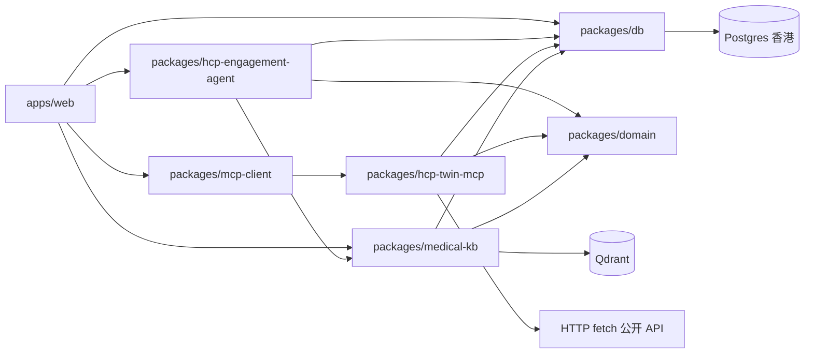

# 技术栈与开发依赖（HCP Engagement Assistant）

> 规格基准日 2026-07-16；**与实现核对 as_of：2026-07-20**。  
> **整体架构**见 [`3.architecture.md`](./3.architecture.md)；产品见 [`1.product-definition.md`](./1.product-definition.md)；缺口见 [`ToDo.md`](./ToDo.md)。  
> **功能规格**：[`app/app-function-spec.md`](./app/app-function-spec.md) · [`mcp/mcp-function-spec.md`](./mcp/mcp-function-spec.md) · [`agent/agent-function-spec.md`](./agent/agent-function-spec.md) · [`rag/rag-function-spec.md`](./rag/rag-function-spec.md)  
> UI 原型：[`app/hcp-ui-prototype.canvas.tsx`](./app/hcp-ui-prototype.canvas.tsx) · 指南 [`6.ui-guideline.md`](./6.ui-guideline.md)

---

## 0. 初始化依赖（首次 clone 必做）

`npm install` 只安装 Node 依赖。**业务主数据**存 **香港 Postgres**（环境变量 `DATABASE_URL`），**不再**用本地 JSON 作 Twin / Options / 会话主库。RAG **语料源文件**与 **Qdrant 卷**仍可用仓库下 `data/rag`、`data/qdrant`（非主库）。

### 0.1 存储分工

| 资产 | 位置 | 写入方 |
|------|------|--------|
| Twin / Insights / Options / Sessions / 租户元数据 | **Postgres（香港）** | `hcp-twin-mcp`、BFF、Agent |
| ingest manifest 元数据 | **Postgres** | `medical-kb` |
| RAG 主题语料（源文件暂存） | `data/rag/corpus/` | `medical-kb` |
| 向量索引 | Qdrant（`data/qdrant/` 或 Docker volume） | Qdrant（默认仅本机/内网） |

详见 §7、[`5.hcp-twin-data-dictionary.md`](./5.hcp-twin-data-dictionary.md)、[`rag/rag-function-spec.md`](./rag/rag-function-spec.md) §0.1。

### 0.2 环境变量与目录（与 `npm install` 同级）

```bash
cp .env.example .env
# 编辑 .env：填入 DATABASE_URL（见 §7.3）；密码勿提交 Git

mkdir -p data/rag/corpus/academic \
         data/rag/corpus/compliance \
         data/rag/corpus/tenants \
         data/qdrant

# 可选：语料/向量本地根（与主库无关）
export HCA_DATA_DIR="${HCA_DATA_DIR:-$(pwd)/data}"
```

**推荐顺序（新开发者）：**

一键（国内镜像装 npm/sharp + Qdrant 二进制，并启动 Qdrant / MCP / Web）：

```bash
# 已有 clone：先 cp .env.example .env 并填 DATABASE_URL
npm run init
# 空目录：bash scripts/init.sh --clone-to ~/code/hcp-engagement-assistant
# 停止：npm run stop
```

手工等价步骤：

```bash
git clone <repo-url> hcp-engagement-assistant
cd hcp-engagement-assistant
npm install
cp .env.example .env   # 配置 DATABASE_URL
mkdir -p data/rag/corpus/{academic,compliance,tenants} data/qdrant
npm run build          # workspace 导出 dist/；干净 clone 必做
npm run db:migrate
npm run start:qdrant   # 二进制经 GITHUB_PROXY 拉取，见 scripts/start-qdrant.sh
# 可选：npm run rag:seed-compliance
# 终端：npm run dev:hcp-twin-mcp 与 npm run dev:web
```

干净 clone 失败分层（sharp/GitHub、dist/、.env、Qdrant 进程）见 [`docs/adr/ADR-003-clean-clone-bootstrap.md`](../docs/adr/ADR-003-clean-clone-bootstrap.md)。

### 0.3 Git 与 `.gitignore`

- **禁止**将数据库密码、`.env` 提交仓库；仅提交 `.env.example`（占位符）。
- **纳入版本库**：`data/rag/corpus/compliance/**`、`data/rag/corpus/academic/**`（公开合规种子与学术 fixture 语料，供 seed / 验收）。
- **仍 gitignore**：`data/qdrant/**`（向量运行时卷）、`data/rag/corpus/tenants/**`（客户 SOP）、历史本地 `data/twins|engagements|tenants/`。
- 包内镜像种子：`packages/medical-kb/fixtures/`（与 corpus 同步用途；二选一或并存均可 seed）。
- 客户 SOP / 非公开灌库语料**禁止**进 Git 或公开文档站。

### 0.4 健康检查

实现 `GET /api/health` 时须验证：`DATABASE_URL` 可达且可查询；Qdrant 可达且绑定安全；MCP `health_check`；可选 Agent/LLM 探测；语料目录（若启用）存在。

---

## 1. 技术栈总览

> **落地状态列**：已装 = 当前 `package.json` 已依赖；未用 = 已装但代码未接；后置 = 规格保留、不挡 MVP。

### 1.1 应用与智能体

| 类别 | 技术 | 版本建议 | 落地 | 说明 |
|------|------|----------|------|------|
| **前端框架** | Next.js（App Router） | 16.x | 已装 | UI + BFF；开发口 `3001` |
| **UI 库** | React | 19.x | 已装 | |
| **语言** | TypeScript | 5.9.x | 已装 | |
| **样式** | Tailwind CSS | 4.x | 已装 | `@theme` + `globals.css` HCA token |
| **服务端状态** | TanStack React Query | 5.x | 已装·未用 | 进度/列表现为自写 `fetch` 轮询；可后接 |
| **客户端状态** | Zustand | 5.x | 已装 | 顶栏多开、locale 等 |
| **校验** | Zod | 4.x | 已装 | 表单与 API；**未**用 React Hook Form |
| **表单（后置）** | React Hook Form | 7.x | 后置 | 身份录入现为受控组件 + Zod |
| **ID（后置）** | @paralleldrive/cuid2 | 3.x | 后置 | 现用业务/`run_*` 字符串 |
| **主数据存储** | **PostgreSQL（香港）** | 16.x+ | 已用 | Twin / Insights / Options / 会话 |
| **DB 访问** | `pg` + Zod | — | 已装 | `packages/db`；**不用** Prisma |
| **向量库** | Qdrant | 1.12+ | 已用 | `@qdrant/js-client-rest` |
| **队列（后置）** | BullMQ + Redis | 5.x / 8.x | 后置 | ingest / build 为进程内异步 |
| **Agent 编排** | 手写薄主路径 | — | 已用 | `proposeOptions` 顺序编排；**LangGraph 后置** |
| **LLM** | Qwen（OpenAI 兼容） | qwen-plus 等 | 已用 | 无 Key 时规则降级 |
| **AI SDK** | openai | 6.x | 已装 | 仅 `hcp-engagement-agent` |
| **中文名罗马化** | pinyin-pro | 3.x | 已装 | `hcp-twin-mcp` / `hcp-engagement-agent`：CJK→Given Family 检索 OpenAlex 拉丁作者簇（F-WEB-047） |
| **Embedding** | Xenova `bge-small-zh` | — | 已装 | medical-kb 进程内 |
| **Rerank** | Xenova / cosine 降级 | — | 已用 | 可 `RERANK_DISABLE` |
| **采集层** | hcp-twin-mcp | — | 已用 | Streamable HTTP `:3200` |
| **MCP 协议** | @modelcontextprotocol/sdk | 1.x | 已装 | |
| **HTTP 采集** | native fetch | — | 已用 | OpenAlex / ORCID / CT.gov / PubMed 等 |
| **浏览器自动化** | Playwright | 1.55+ | 后置 | 现 `health.playwright=skip`；医院页非阻塞 |
| **单元测试** | Vitest | 4.x | 已装 | 各包；RTL / E2E Playwright **后置** |

### 1.2 洞察与 Options UI

| 类别 | 技术 | 落地 | 说明 |
|------|------|------|------|
| **布局 / 列表 / 时间线** | 自研 + Tailwind | 已用 | 未装 Tremor / ECharts / react-table |
| **对话 UI** | 自研气泡 + 纯文本 | 已用 | `react-markdown` **后置** |
| **图表库（曾选型）** | Tremor / ECharts / react-table | 后置 | 需要图表再装；见历史选型 |
| **导出** | `packages/export-utils` | 后置 | 包未建；洞察现用 `window.print` |

### 1.3 合规与策略（非 npm，运行时加载）

| 资源 | 路径 | 用途 |
|------|------|------|
| `cn-hcp-pro` | 本仓 `.cursor/skills/cn-hcp-pro/`（亦可装至用户级 `~/.cursor/skills/`） | Engagement 策略人设与输出模板 |
| `cn-hcp-compliance` | 本仓 `.cursor/skills/cn-hcp-compliance/` | 生成后 Fail-fast 合规闸门 |
| `agent-builder` / `mcp-server-patterns` / `rag-implementation` | 本仓 `.cursor/skills/` | 实现时按技能约束架构与边界 |
| 术语表 | `knowledge/agent-hcp-engagement/glossary-abbreviations.md` | 缩写与监管用语统一 |

---

## 2. `apps/web` npm 依赖清单（与仓库一致）

权威以 `apps/web/package.json` 为准（2026-07-20）：

```json
{
  "dependencies": {
    "next": "16.2.0",
    "react": "19.2.4",
    "react-dom": "19.2.4",
    "@tanstack/react-query": "^5.90.0",
    "zustand": "^5.0.0",
    "zod": "^4.4.0",
    "@hca/domain": "*",
    "@hca/db": "*",
    "@hca/mcp-client": "*",
    "@hca/medical-kb": "*",
    "@hca/hcp-engagement-agent": "*"
  },
  "devDependencies": {
    "typescript": "^5.9.0",
    "tailwindcss": "^4",
    "@tailwindcss/postcss": "^4",
    "vitest": "^4.1.0",
    "eslint": "^9",
    "eslint-config-next": "16.2.0",
    "@types/node": "^22",
    "@types/react": "^19",
    "@types/react-dom": "^19"
  }
}
```

**刻意不进 web（后置 / 他包）：** Tremor、ECharts、react-table、react-markdown、RHF、cuid2、bullmq、ioredis、`@hca/export-utils`、`@langchain/*`、`playwright`。

> **npm workspaces**：根 `package.json` → `packages/*`、`apps/*`；包间 `"*"`。  
> **`.npmrc`**：`legacy-peer-deps=true`（镜像 registry 可选）。  
> **LLM**：仅 `packages/hcp-engagement-agent` 装 `openai`；Web 经包 API 调用。

### 2.1 Next.js 约定

- 对话、Options、构建进度等置于 Client Component（`"use client"`）；
- 前端 **只** 调 `/api/*`；禁止浏览器直连 MCP、Qdrant、LLM Key；
- 长任务：返回 `runId` 后自写轮询（React Query 已装未接）。

---

## 3. 仓库结构（目标）

```text
hcp-engagement-assistant/
├── apps/
│   └── web/                         # @hca/web · Next.js UI + BFF
├── packages/
│   ├── db/                          # @hca/db · Postgres 客户端 / 迁移
│   ├── hcp-twin-mcp/                # @hca/hcp-twin-mcp · Twin 采集 MCP Server
│   ├── mcp-client/                  # @hca/mcp-client · BFF 侧 MCP 调用
│   ├── domain/                      # @hca/domain · Zod schema + 共享类型
│   ├── medical-kb/                  # @hca/medical-kb · ingest + 双索引检索
│   ├── hcp-engagement-agent/        # @hca/hcp-engagement-agent · 5 capabilities + 手写薄编排
│   └── （后置）export-utils/        # Options/洞察导出；尚未建包
├── data/                            # 仅 RAG 语料暂存 + Qdrant 卷（非 Twin 主库）
│   ├── rag/
│   │   ├── corpus/                  # academic|compliance（进 Git）· tenants（gitignore）
│   │   └── eval-set.json            # 后置
│   └── qdrant/                      # gitignore；或 Docker volume
├── knowledge/                       # 研究结论、术语表
├── specs/                           # 权威规格
├── scripts/                         # 如 start-qdrant.sh
├── .cursor/skills/                  # 本仓 Agent Skills
├── package.json
├── package-lock.json
├── .npmrc
├── .env.example
└── docker-compose.yml               # web + hcp-twin-mcp + qdrant；Postgres 用香港托管
    docker/Dockerfile.web
    docker/Dockerfile.mcp
    .dockerignore
```

### 3.1 落地状态（2026-07-20）

| 项 | 状态 |
|----|------|
| npm workspaces + 七包（无 export-utils） | ✅ |
| `packages/db` 迁移 001–004（twins / insights / rag / engagement / `_agent_general`） | ✅ |
| `hcp-twin-mcp` Tools + Resources + live Stage A–E（HTTP 采集；Playwright 后置） | ✅ |
| `apps/web` 壳 + 工作台 + 智能体情报构建常驻区 | ✅ |
| `medical-kb` 双索引 + Hybrid + seed / ingest_on_demand | ✅ MVP-3 |
| `hcp-engagement-agent` propose / chat / gate / doing_now（手写薄路径；无 LangGraph） | ✅ MVP-4 |
| docker-compose / BullMQ / Playwright / LangGraph / Tremor | Compose 已提供（web/mcp/qdrant）；BullMQ 等后置 · 见 [`ToDo.md`](./ToDo.md) |

---

## 4. 组件与依赖关系



| 包 | 依赖（现行） | 禁止 |
|----|--------------|------|
| `apps/web` | `mcp-client`, `domain`, `db`, `medical-kb`, `hcp-engagement-agent` | `playwright`、直连 Qdrant/LLM |
| `hcp-twin-mcp` | `@modelcontextprotocol/sdk`, `domain`, `db`（Playwright **后置**） | `next`、UI |
| `medical-kb` | `@qdrant/js-client-rest`, `@xenova/transformers`, `domain`, `db` | 业务 UI |
| `hcp-engagement-agent` | `medical-kb`, `domain`, `db`, `openai`（LangGraph **后置**） | 爬虫、Playwright |
| `db` | `pg` + Zod | UI、Playwright |
| `mcp-client` | `@modelcontextprotocol/sdk` | `playwright` |

---

## 5. hcp-twin-mcp（Twin 采集 MCP）

### 5.1 职责

- 实现 Twin 相关 MCP Tools（身份锚点、分 collector 抓取、Insights 衍生）。
- Collector：职业（OpenAlex 等 HTTP）、科研（OpenAlex / ORCID / PubMed）、热力（CT.gov 等）；医院页 Playwright **后置**。
- 输出写入香港 **Postgres**（见 §7）。构建进度真相在 MCP **进程内队列**（非 `twin_build_runs` 表）。

### 5.2 Tools（P0）

与 [`mcp/mcp-function-spec.md`](./mcp/mcp-function-spec.md) 对齐：

| Tool | 说明 |
|------|------|
| `resolve_hcp_identity` | 姓名 + 医院 + 科室 → 人候选 `candidates[]`（含证据与草稿 `hcpId`） |
| `build_twin` | 触发全量/增量构建，返回 `runId` |
| `get_twin_status` | 构建进度 |
| `get_twin` / `get_insights` | 读 Postgres Twin / Insights |
| `tag_hcp` | 规则/覆盖写入 `profile.tags`（可在 resolve / Stage A 后重算） |
| `health_check` | 进程、Postgres 可达、可选 Playwright 就绪；供 BFF `/api/health` |

### 5.3 运行方式

| 命令 | 场景 |
|------|------|
| `npm run dev:hcp-twin-mcp` | 开发：`stdio` 或 HTTP `:3200` |
| `npm run start:hcp-twin-mcp` | 生产：Streamable HTTP，供 `web` 内网调用 |

### 5.4 环境变量（MCP 进程）

| 变量 | 必填 | 说明 |
|------|------|------|
| `MCP_TRANSPORT` | 否 | `stdio` \| `http`（默认 `http`） |
| `MCP_PORT` | 否 | 默认 `3200` |
| `DATABASE_URL` | 是 | 香港 Postgres 连接串（与 web / Agent 共用） |
| `HCA_DATA_DIR` | 否 | 仅 RAG 语料/Qdrant 根，默认 `./data` |
| `TWIN_MODE` | 否 | `live`（默认）\| `mock`（仅 CI；须同时 `ALLOW_TWIN_MOCK=1` 或 Vitest，否则回落 live） |
| `ALLOW_TWIN_MOCK` | 否 | `1` 时允许 `TWIN_MODE=mock`；产品进程勿开 |
| `CRAWLER_HEADLESS` | 否 | 生产 `true`；调试 `false` |
| `NCBI_API_KEY` | 否 | PubMed E-utilities 限速放宽 |
| `REDIS_URL` | 否 | 可选：构建任务队列 |

---

## 6. medical-knowledge-base（`packages/medical-kb`）

与 [`rag/rag-function-spec.md`](./rag/rag-function-spec.md) 对齐。

### 6.1 职责

- **双索引**：`academic_index` + `compliance_index`（见 `knowledge/rag-medical-knowledge-base/rag-architecture.md`）。
- 主题语料可暂存 `data/rag/corpus/{academic,compliance,tenants}`，再 embed 入 Qdrant；manifest 元数据写 Postgres。
- Hybrid 检索：进程内 dense + BM25 sparse → RRF → rerank（模型见上表）。
- 按需 ingest：Twin `specialty/themes` 触发公开源拉取；合规种子自 `corpus/compliance` 预灌。
- **默认禁止**公网暴露 Qdrant、默认禁止托管向量 SaaS（须 ADR + `VECTOR_BACKEND`）。

### 6.2 对外 API（供 Agent / BFF）

| 方法 | 说明 |
|------|------|
| `retrieve_academic` | 专科 / 主题过滤检索 |
| `retrieve_compliance` | 合规检索（Agent 提案路径**强制**） |
| `ingest_on_demand` | 异步灌注；先落 corpus 再 upsert；写 manifest |
| `get_ingest_status` | 按 `jobId` 或 `specialty` 查进度 |
| `seed_compliance` | 自本地 corpus 灌合规种子 |
| `upsert_tenant_sop` | 租户 SOP → corpus + tenant 过滤字段 |
| `health` | Qdrant、双 collection、绑定是否安全 |

### 6.3 环境变量

| 变量 | 必填 | 说明 |
|------|------|------|
| `QDRANT_URL` | 是 | 默认 `http://127.0.0.1:6333`（回环或内网） |
| `VECTOR_BACKEND` | 否 | 默认 `qdrant-local`；改公有云须 ADR |
| `QDRANT_ALLOW_NON_LOCAL` | 否 | 允许非本机 URL 的显式开关（默认 false） |
| `EMBEDDING_MODEL` | 是 | 默认 `Xenova/bge-small-zh-v1.5`（进程内） |
| `HF_ENDPOINT` / `TRANSFORMERS_REMOTE_HOST` | 否 | 首次下载模型镜像，如 `https://hf-mirror.com` |
| `EMBEDDING_BASE_URL` | 否 | OpenAI 兼容内网 embedding；设则不用 Xenova |
| `RERANK_MODEL` | 否 | bge-reranker；或 `RERANK_DISABLE=true` 用 dense cosine |
| `DATABASE_URL` | 是 | ingest manifest 等元数据 |
| `HCA_DATA_DIR` | 否 | 语料暂存在 `{HCA_DATA_DIR}/rag/corpus`，默认 `./data` |
| `NCBI_API_KEY` | 否 | 学术按需拉取限速（MVP-3） |

---

## 7. 数据存储（香港 Postgres + Qdrant）

### 7.1 设计原则

| 原则 | 说明 |
|------|------|
| **Postgres 主库** | Twin、Insights、Options、Session、租户、ingest manifest 元数据均在香港 Postgres |
| **Schema 校验** | 读写经 `@hca/domain` Zod；JSONB 列存结构化文档，拒绝脏数据入库 |
| **事务写入** | 同 `hcpId` 构建用事务或行锁；避免半截文档 |
| **单写者 / 互斥** | 同 `hcpId` 构建任务互斥（DB 锁或 Redis 锁） |
| **可审计** | 保留 `source`、`as_of`、`version`；Options 带 `compliance_refs[]` |
| **密钥** | 连接串仅 `.env` / 密钥管理；**禁止**写入规格正文与 Git |
| **向量分离** | 不做 pgvector 作主向量库（P0）；向量仅 **Qdrant** |

### 7.2 逻辑表（示意）

| 表 | 内容 | 迁移 |
|----|------|------|
| `hcp_twins` | `hcp_id` PK；`identity` / `twin` JSONB；`tags`；`as_of`；`twin_version` | 001 |
| `hcp_insights` | `hcp_id` PK/FK；`payload` JSONB（含 `doing_now`） | 001 |
| `ingest_manifest` / `rag_ingest_jobs` | 灌库清单与异步 job | 002 |
| `engagement_options` | `run_id`；`hcp_id`；方案 JSONB；引用字段 | 003 |
| `chat_sessions` | `session_id`；`hcp_id`（`open_chat` → `_agent_general`）；`mode`；消息 JSONB | 003–004 |
| `tenants` | 租户与 SOP 元数据 | 后置 |
| （可选）`twin_build_runs` | 构建进度持久化 | **未建**；现行 MCP 进程内 status |

字段名与 [`5.hcp-twin-data-dictionary.md`](./5.hcp-twin-data-dictionary.md) 对齐；实现为 SQL 迁移 + `pg`（非 Prisma）。

### 7.3 连接配置（香港）

| 项 | 值 |
|----|-----|
| 主机 | `101.132.156.250`（香港服务器） |
| 端口 | `5432`（默认） |
| 用户 | `postgres` |
| 库名 | `hca`（约定；若实例已有库名以实际为准） |
| 密码 | **仅**通过环境变量注入，见 `.env` / 密钥管理 |

```bash
# .env（勿提交）
DATABASE_URL=postgresql://postgres:<PASSWORD>@101.132.156.250:5432/hca
```

实现后：`npm run db:migrate` 对上述实例建表。开发机需能访问该主机（防火墙 / 安全组放行）。

### 7.4 本地 `data/`（仅非主库资产）

```text
data/
└── rag/
    ├── corpus/
    │   ├── academic/              # 公开学术种子（进 Git）
    │   ├── compliance/            # 公开合规种子（进 Git）
    │   └── tenants/               # 客户 SOP（gitignore，仅 .gitkeep）
    └── eval-set.json              # 可选回归用例
data/qdrant/                       # Qdrant 卷（gitignore；或 Docker volume）
```

> Twin / Options **不再**使用 `data/twins`、`data/engagements` 文件树。

### 7.5 数据访问层（`packages/db`）

```typescript
// 示意 API
getTwin(hcpId): VirtualTwin
upsertTwin(hcpId, data, schema): void
getInsights(hcpId): HcpInsights
listTwins(): TwinListItem[]  # 排除系统占位 `_agent_general`（通用 open_chat FK，非真实 HCP）
```

- BFF、MCP、Agent、medical-kb **共用**同一 `DATABASE_URL`；
- 向量仅存 **Qdrant**；业务查询走 Postgres。

### 7.6 Redis（可选，非主存储）

| 用途 | 说明 |
|------|------|
| BullMQ | `twin-build`、`heatmap-poll`、`rag-ingest` |
| 分布式锁 | 多实例时同 `hcpId` 互斥写 |
| SSE / 轮询 | `runId` 任务状态缓存 |

### 7.7 Qdrant 卷

| 路径 | 内容 |
|------|------|
| `data/qdrant/` 或 Docker volume | `academic_index`、`compliance_index` 向量与 payload |


## 8. hcp-engagement-agent（`packages/hcp-engagement-agent`）

与 [`agent/agent-function-spec.md`](./agent/agent-function-spec.md)、[`agent/initial-prompt.md`](./agent/initial-prompt.md) 对齐。

### 8.0 包依赖（与仓库一致）

```json
{
  "dependencies": {
    "openai": "^6.39.0",
    "@hca/medical-kb": "*",
    "@hca/domain": "*",
    "@hca/db": "*",
    "zod": "^4.4.0"
  }
}
```

`@langchain/langgraph` / `@langchain/core`：**后置**。现行提案路径为 `proposeOptions` 手写顺序编排（insights → 双路 retrieve → gate → 生成 → 落库），语义对齐原薄 LangGraph 图。

### 8.1 P0 Capabilities（Tools · Options/Chat loop 内 5 个）

| Tool | 数据源 |
|------|--------|
| `get_twin_insights` | Postgres `hcp_insights`（含 `doing_now`） |
| `retrieve_academic` | `medical-kb` → Qdrant |
| `retrieve_compliance` | `medical-kb` → Qdrant（提案路径**不可跳过**） |
| `propose_engagement_options` | LLM + 上下文 → Postgres `engagement_options` |
| `revise_engagement` | 读/写 Postgres `chat_sessions`，写回修订 |

另：**包级 API**（不占 Tool 名额）`synthesizeDoingNow` → 写 `insights.doing_now`（数字分身与 HCP 洞察同源）。

### 8.2 BFF 可调入口

| API | 说明 |
|-----|------|
| `synthesizeDoingNow` | 一句话洞察 |
| `proposeOptions` | 手写薄编排提案主路径（LangGraph 后置） |
| `chat` | `mode=open_chat` \| `revise_options` |
| `runComplianceGate` | 生成后 Fail-fast |
| `health`（可选） | LLM / data_dir / medical-kb |

### 8.3 提案主路径编排（现行 · 手写薄路径）

```text
START → get_twin_insights
      → retrieve_academic ‖ retrieve_compliance
      → compliance_gate
      → generate_options（附 academic_refs + compliance_refs）
      → cn-hcp-compliance 检查（可选独立步 / 用户按钮）
      → persist engagement_options
      → END
```

Chat / 修订**不**强制重跑全路径。若日后引入 LangGraph，须保持同一节点语义与 BFF API 不变。

### 8.4 环境变量（LLM Provider 适配）

所有生成经 `LlmClient`；默认 `LLM_PROVIDER=qwen`。

| 变量 | 必填 | 说明 |
|------|------|------|
| `LLM_PROVIDER` | 否 | 默认 `qwen`；或 `openai_compatible` |
| `LLM_MODEL` | 否 | 默认 `qwen-plus` |
| `LLM_BASE_URL` | 否 | 通用兼容端点；`qwen` 可用 `DASHSCOPE_BASE_URL` |
| `LLM_API_KEY` | 条件 | 通用键；`qwen` 可用 `DASHSCOPE_API_KEY` |
| `DASHSCOPE_API_KEY` | 条件 | Qwen 默认路径推荐 |
| `DASHSCOPE_BASE_URL` | 否 | DashScope OpenAI 兼容地址 |
| `DATABASE_URL` | 是 | 香港 Postgres；与 web / MCP 共用 |
| `HCA_DATA_DIR` | 否 | 仅 RAG 语料根（可选） |
| `LLM_TIMEOUT_MS` / `LLM_MAX_RETRIES` | 否 | 超时与重试 |

---

## 9. UI 应用（apps/web）

与 [`app/app-function-spec.md`](./app/app-function-spec.md) 对齐。

### 9.1 页面与 API（现行）

| 表面 | 路由 / BFF | 后端 |
|------|------------|------|
| 数字分身列表 | `GET/POST /api/twins`；`POST /api/twins/resolve`；`POST /api/twins/confirm` | MCP + `db` |
| 分身工作台 · HCP资料 | `GET/PATCH/DELETE /api/twins/[hcpId]`；`POST .../build`；`GET .../status` | MCP + `db`；智能体情报构建常驻 UI |
| HCP 洞察 | `GET /api/insights/[hcpId]`；`POST /api/insights/doing-now` | Postgres insights；Agent `synthesizeDoingNow` |
| 一人一策 | `POST /api/engagement/options`；`.../compliance-check`；`.../chat`（revise） | Agent |
| Agent Tab | `POST /api/engagement/chat`（`open_chat`）；`.../sessions` | Agent；`hcp_id=_agent_general` |
| RAG | `POST /api/rag/ingest`；`GET /api/rag/ingest/status` | medical-kb |
| 健康 | `GET /api/health` | Postgres + MCP +（可选）Qdrant |

### 9.2 BFF 约定

- 长时间 Twin 构建返回 `runId`；UI 自写轮询 `get_twin_status`（SSE / React Query **后置**）。
- 对话：`open_chat`（通用）与 `revise_options`（一人一策）分 mode；localStorage 另存；SSE **LOW PRIORITY**。
- `004_agent_general_workspace.sql` 占位 `_agent_general`；列表排除且不可删。
- 健康检查：Postgres + MCP `health_check`（+ 可选 medical-kb / LLM）。

### 9.3 环境变量（Web 进程）

| 变量 | 必填 | 说明 |
|------|------|------|
| `DATABASE_URL` | 是 | 香港 Postgres |
| `MCP_URL` | 生产是 | 例 `http://hcp-twin-mcp:3200` |
| `QDRANT_URL` | 是 | 供 medical-kb；浏览器禁止直连 |
| `HCA_DATA_DIR` | 否 | RAG 语料/Qdrant 根，默认 `./data` |
| `REDIS_URL` | 否 | 异步任务 |
| `LLM_*` / `DASHSCOPE_*` | 条件 | 若 BFF 同进程调 Agent，与 §8.4 一致；Key **仅服务端** |

---

## 10. 外部服务

| 服务 | 用途 | 配置 |
|------|------|------|
| **DashScope Qwen**（默认）或其它 OpenAI 兼容网关 | Options、对话、doing_now、摘要 | `LLM_*` / `DASHSCOPE_*` |
| **PubMed E-utilities** | 论文与 MeSH | `NCBI_API_KEY`（可选） |
| **Qdrant（本地）** | 向量检索 | `QDRANT_URL`；默认非公网 |
| **Embedding / Rerank** | 自托管或内网 API | `EMBEDDING_*`、`RERANK_*` |

公开医学信息经 **hcp-twin-mcp + HTTP fetch**（OpenAlex / ORCID / PubMed / CT.gov 等）采集；医院官网 Playwright **后置**。向量默认**不**用公有云 SaaS。

---

## 11. 开发与测试

### 11.1 本地启动

```bash
npm install

# 首次 / 新环境：配置 DATABASE_URL + RAG/Qdrant 目录（见 §0.2 / §7.3）
cp -n .env.example .env 2>/dev/null || true
mkdir -p data/rag/corpus/academic data/rag/corpus/compliance data/rag/corpus/tenants data/qdrant
export HCA_DATA_DIR="${HCA_DATA_DIR:-$(pwd)/data}"
npm run db:migrate

# 终端 1：Qdrant（默认仅 127.0.0.1:6333）
npm run start:qdrant
# 或：docker run -d -p 127.0.0.1:6333:6333 -v $(pwd)/data/qdrant:/qdrant/storage qdrant/qdrant:v1.14.1

# 合规种子（可选，验收前）
npm run rag:seed-compliance

# 终端 2：hcp-twin-mcp
npm run dev:hcp-twin-mcp

# 终端 3：Web
npm run dev:web
```

medical-kb 验收：

```bash
# Qdrant 须已启动；首次会经 HF_ENDPOINT 下载 Xenova embedding
npm test -w @hca/medical-kb
```

### 11.2 测试策略

完整策略与 **SMART DoD** 见 [`7.test-strategy.md`](./7.test-strategy.md)。摘要：

| 层级 | 工具 | 范围 |
|------|------|------|
| Domain schema | Vitest | Twin / Insights / Options Zod 往返 |
| DB / domain | Vitest | Zod 往返、事务、并发互斥 |
| Collector 契约 | Vitest + fixture HTML/JSON | 职业/科研解析纯函数 |
| MCP Tool | Vitest + `TWIN_MODE=mock` | Tool I/O 契约 |
| medical-kb | Vitest | 检索过滤、合规强制命中 |
| Agent | Vitest | 5 tools、`synthesizeDoingNow`、chat mode、合规 gate、引用字段 |
| UI | Vitest | 组件/纯函数（RTL / E2E **后置**） |
| E2E | Playwright Test | **后置**；浏览器只调 BFF |

### 11.3 质量门禁

```bash
npm run test          # 各 workspace Vitest
npm run typecheck
npm run build         # domain → … → web
# npm run test:e2e    # 后置（根脚本若未声明则跳过）
```

---

## 12. 生产部署（Docker Compose）

仓库提供 [`docker-compose.yml`](../docker-compose.yml) + [`docker/Dockerfile.web`](../docker/Dockerfile.web) + [`docker/Dockerfile.mcp`](../docker/Dockerfile.mcp)。

| 服务 | 基础镜像 | 关键挂载 / 环境 |
|------|----------|-----------------|
| `web` | `node:22-bookworm-slim` + Next standalone | `DATABASE_URL`、`MCP_URL=http://hcp-twin-mcp:3200`、`QDRANT_URL=http://qdrant:6333`；宿主机 `:3001` |
| `hcp-twin-mcp` | `node:22-bookworm-slim` | `DATABASE_URL`、`TWIN_MODE=live`；宿主机 `:3200` |
| `qdrant` | `qdrant/qdrant:v1.14.1` | `./data/qdrant`；**仅** `127.0.0.1:6333` |
| `redis` / `nginx` | 可选 · 后置 | 多实例队列 / TLS |

```bash
cp .env.example .env   # 填 DATABASE_URL
docker compose up -d --build
```

CI 构建：`.github/workflows/docker-build.yml`（PR 只 build；`main` / `v*` 推 GHCR）。

**Postgres 使用香港托管实例**（不在 compose 内默认起库）。

---

## 13. 与参考栈（social-media-mkt）差异

| 项目 | 参考栈 | 本仓（HCP Engagement Assistant） |
|------|--------|----------------------------------|
| 产品域 | 自媒体营销洞察 | 药企 HCP Twin + Engagement |
| 采集 MCP | socia-media-mkt（四平台登录） | **hcp-twin-mcp**（公开医学信息） |
| 主存储 | PostgreSQL `mia` | **香港 PostgreSQL**（Twin / Options / 会话） |
| 向量库 | 无 | **Qdrant** 双索引 RAG |
| 智能体 | insight-engine 摘要 | **hcp-engagement-agent** + 手写薄编排 + 合规 gate（LangGraph 后置） |
| 核心 UI | 搜索 / Watch / 报表 | 壳 + 分身工作台（资料/洞察/一人一策）+ Agent Tab |
| Playwright | 平台登录与搜索 | **后置**；现行 Twin MCP 以 HTTP 公开 API 为主 |
| 合规 | 内容平台规则 | **cn-hcp-compliance** + RDPAC / 医药代表办法 |

---

## 14. MVP 交付依赖顺序

与 [`1.product-definition.md`](./1.product-definition.md) **四个**可独立闭环 MVP 对齐。

| 顺序 | MVP | 交付物 | 独立闭环验收 |
|------|-----|--------|--------------|
| 0 | — | `.env` + `DATABASE_URL` + `db:migrate` | 可读写 Twin 表 |
| 1 | **MVP-1** | `domain`/`db` + MCP live resolve/confirm/`build_twin` + Web 身份 CRUD + 构建进度 | 查询→保存→详情构建→进度→情报落库 |
| 2 | **MVP-2** | Insights UI + `synthesizeDoingNow` | 洞察八块 + 同源一句话（fixture 可） |
| 3 | **MVP-3** | medical-kb 合规 + 学术按需 | 条款可引用；专科可检索 |
| 4 | **MVP-4** | Options + 闸门 + open_chat | 方案 + 修订 + 开放对话 |

**验收用例**：复旦大学附属中山医院朱同玉教授（见产品定义）。

---

## 15. 参考

- 产品：[`1.product-definition.md`](./1.product-definition.md)（功能 Index · MVP-1…4）
- 业务：[`2.business-context.md`](./2.business-context.md)
- 架构：[`3.architecture.md`](./3.architecture.md)
- 测试策略与 DoD：[`7.test-strategy.md`](./7.test-strategy.md)
- Web：[`app/app-function-spec.md`](./app/app-function-spec.md) · 原型 [`app/hcp-ui-prototype.canvas.tsx`](./app/hcp-ui-prototype.canvas.tsx)
- MCP：[`mcp/mcp-function-spec.md`](./mcp/mcp-function-spec.md)
- Agent：[`agent/agent-function-spec.md`](./agent/agent-function-spec.md) · [`agent/initial-prompt.md`](./agent/initial-prompt.md)
- RAG：[`rag/rag-function-spec.md`](./rag/rag-function-spec.md) · [`knowledge/rag-medical-knowledge-base/rag-architecture.md`](../knowledge/rag-medical-knowledge-base/rag-architecture.md)
- Twin 数据源：[`knowledge/mcp-hcp-virtual-twin/data-sources-zhu-tongyu.md`](../knowledge/mcp-hcp-virtual-twin/data-sources-zhu-tongyu.md)
- 缩写：[`knowledge/agent-hcp-engagement/glossary-abbreviations.md`](../knowledge/agent-hcp-engagement/glossary-abbreviations.md)
